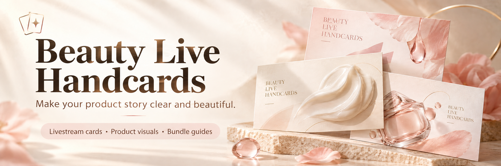

<div align="center">



# Beauty Live Handcards · AI Product Cards for Beauty Livestreams

**Turn beauty product information into visuals your audience can understand.**

[](https://github.com/ouyang-2019/beauty-live-handcards/releases/tag/v0.1.0)
[](LICENSE)
[](docs/installation.md)
[](#showcase)
[](https://x.com/ouyangdashu)

[中文](README.md) · [Downloads](https://github.com/ouyang-2019/beauty-live-handcards/releases/tag/v0.1.0) · [Installation](docs/installation.en.md) · [Gallery](#showcase) · [Contact](#contact)

</div>

A reusable **Agent Skill for skincare and cosmetics brands, beauty livestream teams, ecommerce operators and designers**. Turn product information into **livestream cue cards, ecommerce product images and bundle guides**, combining product scenes, ingredient explanations, promotional copy and image review.

The workflow is designed around Chinese beauty product materials. This English guide explains how to install and use it; the galleries preserve the original Chinese packaging and artwork.

## What you can create

| Output | Contents |
|---|---|
| Single-page livestream card | Packaging, a use scenario, a key selling point, ingredients, size, price and application |
| Product image set | Product hero, 3D explanation, ingredients, matching report pages and application guidance, selected to fit the supplied materials |
| Bundle card | Each product's role, pairing order and a shared use scenario |
| Revised artwork | Updated formula, reports or copy, with refreshed PNG, PDF and ZIP deliverables |

Promotional copy focuses on product highlights. Numerical results keep their metric, test type and necessary conditions beside the figure; production review notes stay in the working materials.

<a id="showcase"></a>

## ✦ Product showcase

**香莱可人 × 漾皑秀 · 5 product sets · 37 original images**

Explore the author's serum, cream, hand care gift set and face mask examples. Click any preview to open its complete gallery.

<table>
  <tr>
    <td align="center" valign="top" width="50%">
      <a href="examples/01-serum/README.md"></a>
      <p><strong>Recombinant Collagen Single-Use Serum</strong><br><sub>香莱可人·重组胶原蛋白次抛精华液</sub></p>
      <p>Single-use serum: hydration care and ingredient storytelling.</p>
      <p><a href="examples/01-serum/README.md"><strong>View all 9 images →</strong></a></p>
    </td>
    <td align="center" valign="top" width="50%">
      <a href="examples/02-cream/README.md"></a>
      <p><strong>Youth Firming & Fine-Line Care Cream</strong><br><sub>香莱可人·青春紧致淡纹精华霜</sub></p>
      <p>Face cream: rich textures, ingredient roles and daily care.</p>
      <p><a href="examples/02-cream/README.md"><strong>View all 7 images →</strong></a></p>
    </td>
  </tr>
  <tr>
    <td align="center" valign="top" width="50%">
      <a href="examples/03-hand-care-gift-set/README.md"></a>
      <p><strong>Luxury Hand Care Gift Set</strong><br><sub>漾皑秀·璀璨奢养玉肌护手礼盒</sub></p>
      <p>Hand care gift set: four tubes and everyday hand care scenes.</p>
      <p><a href="examples/03-hand-care-gift-set/README.md"><strong>View all 7 images →</strong></a></p>
    </td>
    <td align="center" valign="top" width="50%">
      <a href="examples/04-blue-copper-mask/README.md"></a>
      <p><strong>Blue Copper Peptide Hydrating & Soothing Mask</strong><br><sub>漾皑秀·蓝铜肽雪肌舒缓水光面膜</sub></p>
      <p>Blue copper peptide mask: cool-toned product and ingredient visuals.</p>
      <p><a href="examples/04-blue-copper-mask/README.md"><strong>View all 7 images →</strong></a></p>
    </td>
  </tr>
  <tr>
    <td align="center" valign="top" width="50%" colspan="2">
      <a href="examples/05-black-diamond-mask/README.md"></a>
      <p><strong>Black Diamond Radiance Face Mask</strong><br><sub>漾皑秀·黑钻赋活光感驻颜面膜</sub></p>
      <p>Black diamond mask: black-and-gold visuals and application guidance.</p>
      <p><a href="examples/05-black-diamond-mask/README.md"><strong>View all 7 images →</strong></a></p>
    </td>
  </tr>
</table>

[All galleries](examples/README.md) · [Download all 37 images](https://github.com/ouyang-2019/beauty-live-handcards/releases/download/v0.1.0/beauty-live-handcards-product-examples-0.1.0.zip)

## Install and use

**WorkBuddy**: import the WorkBuddy ZIP from the [Release](https://github.com/ouyang-2019/beauty-live-handcards/releases/tag/v0.1.0) through Add Skill → Upload Skill.

**Codex and other Agent Skills hosts**: install the `skills/beauty-live-handcards` directory or the Agent Skills release archive. See [English installation instructions](docs/installation.en.md).

Provide real packaging, ingredients/formula information, verified prices, and matching efficacy reports in your current project directory.

### Copy this starter prompt

```text
Use beauty-live-handcards and read the materials for these two products.
Create one single-page livestream card per product and one combined card:
three separate PNG files in total.
Highlight use scenarios, actual ingredients and supported test findings.
Keep the real packaging, logos, product names and sizes.
Label numerical results with the metric and necessary test conditions.
Keep the card copy in Chinese to match these product materials.
Review the Chinese text, packaging and data before delivery.
Save the files in a "handcards-output" folder in this project.
```

See [English prompt examples](docs/usage.en.md) for a full image set, revisions, copy improvements and a product without a report.

### How the workflow runs

1. Read the product inputs and match packaging, ingredients, prices and reports.
2. Choose the scenes, ingredient story and card/image modules for the request.
3. Generate or edit images with the host's image tools.
4. Read the actual outputs and check copy, packaging, specifications and numerical data.
5. Save the requested deliverables and review records in the project directory.

<a id="contact"></a>

## ♡ Meet the author · Products and collaboration

[](https://x.com/ouyangdashu)

I'm **Ouyang (欧阳)**. Get in touch to discuss the **serum, cream, hand care and face mask products from 香莱可人 and 漾皑秀** featured here, beauty livestream cards, or AI content creation.

<table>
  <tr>
    <td align="center" valign="top" width="50%">
      <p><strong>WeChat · 欧阳</strong></p>
      <a href="assets/contact/wechat.jpg"></a>
      <p>Product enquiries and collaboration<br><a href="assets/contact/wechat.jpg">Open original QR image</a></p>
    </td>
    <td align="center" valign="top" width="50%">
      <p><strong>WeChat Official Account</strong></p>
      <a href="assets/contact/wechat-official-account.jpg"></a>
      <p>Scan to follow<br><a href="assets/contact/wechat-official-account.jpg">Open original QR image</a></p>
    </td>
  </tr>
</table>

<div align="center">

[](https://x.com/ouyangdashu)

**[Visit my X profile →](https://x.com/ouyangdashu)**

</div>

## Runtime and preview status

Image generation/editing and visual reading come from the host. The optional review-record gate requires Python 3.9+ and uses only the standard library.

v0.1.0 is a public preview. The five galleries contain 37 existing product images from the author's Codex project. WorkBuddy file installation and package structure were checked; WorkBuddy image generation has not yet been verified. `qa_gate.py` checks review records and file hashes, not image content.

[Build and validation](docs/development.md) · [Report an issue](https://github.com/ouyang-2019/beauty-live-handcards/issues)

## Feedback and contributions

Open an [issue](https://github.com/ouyang-2019/beauty-live-handcards/issues) with your input type, host/model, problem image and expected result. Documentation improvements and clearer product/ingredient explanations are welcome. See [contribution notes](CONTRIBUTING.md).

## License and credits

Skill rules, scripts, templates and usage documentation are MIT licensed. Product showcase images, report excerpts, brand marks and contact QR codes have separate terms in [NOTICE](NOTICE.md) and [example image terms](examples/LICENSE.md).

The badge and promotional-image presentation was inspired by [CCG Workflow](https://github.com/fengshao1227/ccg-workflow). This project's banners are original artwork.
