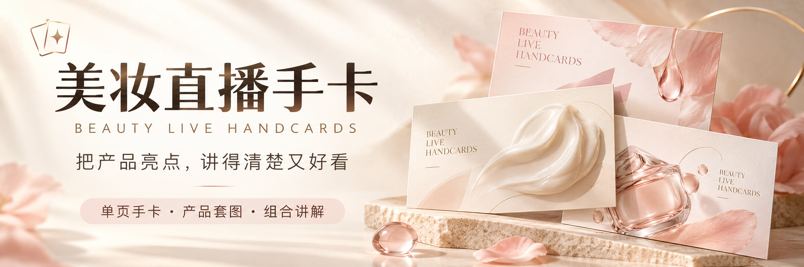
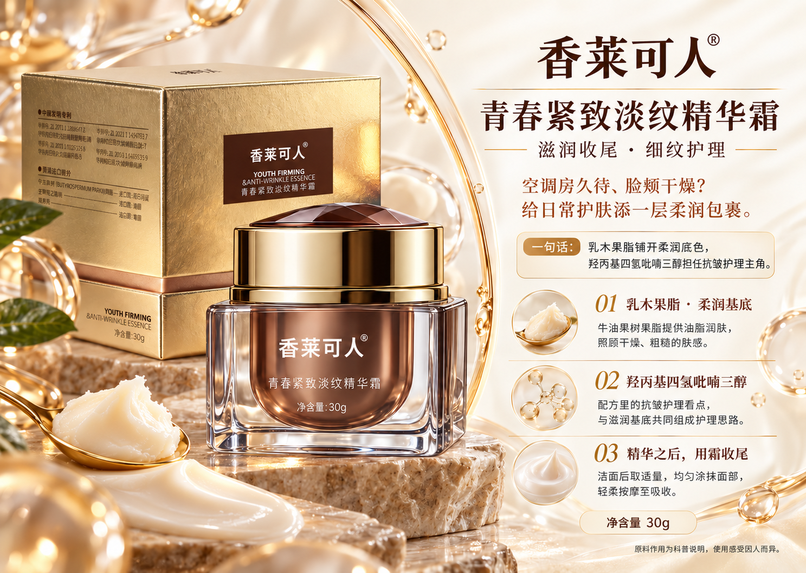
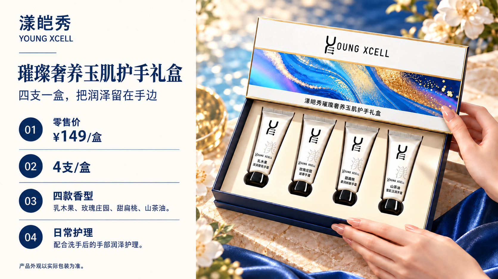
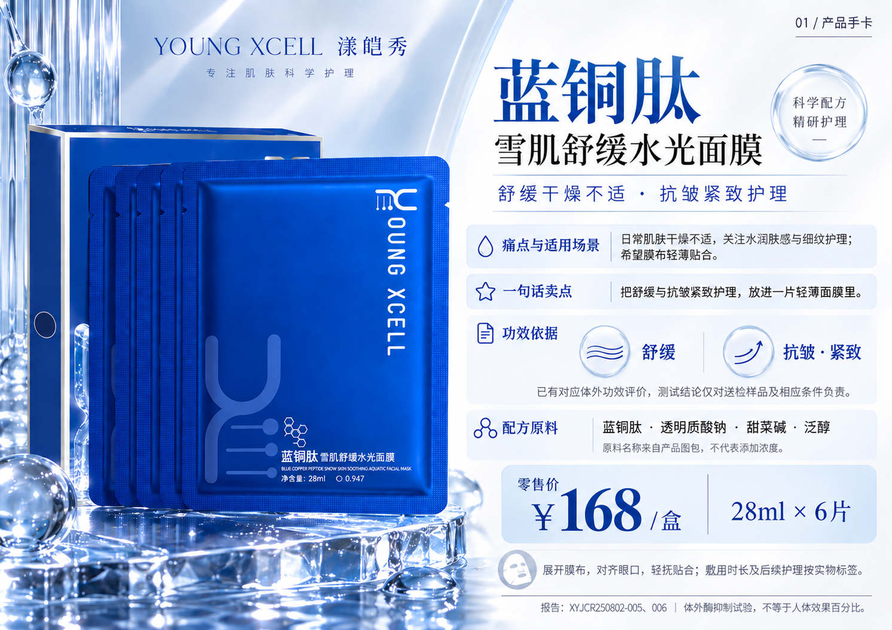
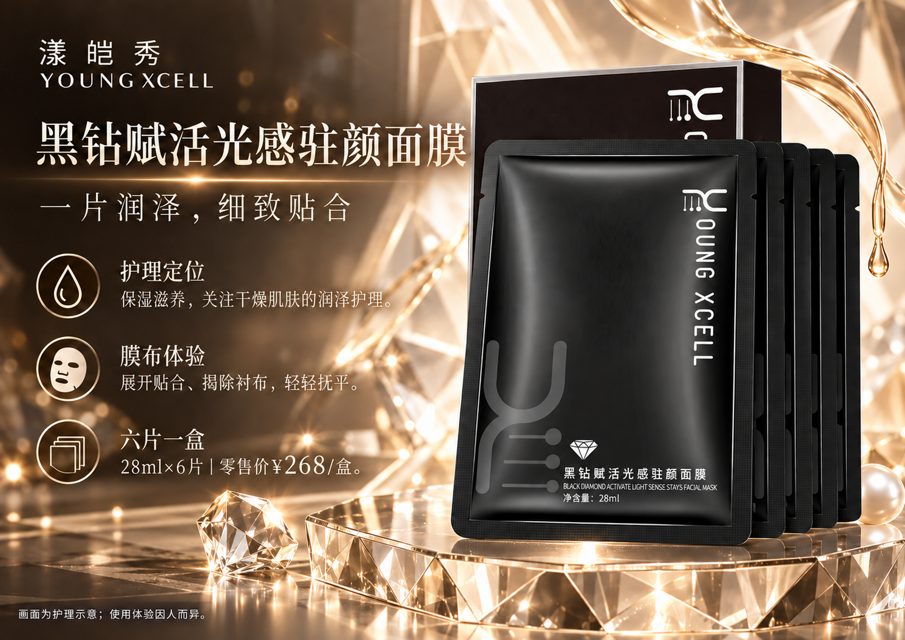

# Beauty Live Handcards

**Turn beauty product information into visuals your audience can understand.**

[中文](README.md) · [Downloads](https://github.com/ouyang-2019/beauty-live-handcards/releases/tag/v0.1.0) · [Installation](docs/installation.md) · [Gallery](#showcase) · [Contact](#contact)

A Chinese-first Agent Skill for beauty brands, livestream teams, ecommerce operators and designers. Create a single livestream card, a product image set, or a bundle card with product scenes, ingredient explanations and image review.

## ✦ Product showcase

**香莱可人 × 漾皑秀 · 5 product sets · 37 original images**

Explore the author's serum, cream, hand care gift set and face mask examples. Click any preview to open its complete gallery.

<table>
  <tr>
    <td align="center" valign="top" width="50%">
      
      
<strong>香莱可人·重组胶原蛋白次抛精华液</strong>

      
Single-use serum: hydration care and ingredient storytelling.

      
<a href="examples/01-serum/README.md"><strong>View all 9 images →</strong></a>

    </td>
    <td align="center" valign="top" width="50%">
      
      
<strong>香莱可人·青春紧致淡纹精华霜</strong>

      
Face cream: rich textures, ingredient roles and daily care.

      
<a href="examples/02-cream/README.md"><strong>View all 7 images →</strong></a>

    </td>
  </tr>
  <tr>
    <td align="center" valign="top" width="50%">
      
      
<strong>漾皑秀·璀璨奢养玉肌护手礼盒</strong>

      
Hand care gift set: four tubes and everyday hand care scenes.

      
<a href="examples/03-hand-care-gift-set/README.md"><strong>View all 7 images →</strong></a>

    </td>
    <td align="center" valign="top" width="50%">
      
      
<strong>漾皑秀·蓝铜肽雪肌舒缓水光面膜</strong>

      
Blue copper peptide mask: cool-toned product and ingredient visuals.

      
<a href="examples/04-blue-copper-mask/README.md"><strong>View all 7 images →</strong></a>

    </td>
  </tr>
  <tr>
    <td align="center" valign="top" width="50%" colspan="2">
      
      
<strong>漾皑秀·黑钻赋活光感驻颜面膜</strong>

      
Black diamond mask: black-and-gold visuals and application guidance.

      
<a href="examples/05-black-diamond-mask/README.md"><strong>View all 7 images →</strong></a>

    </td>
  </tr>
</table>

[All galleries](examples/README.md) · [Download all 37 images](https://github.com/ouyang-2019/beauty-live-handcards/releases/download/v0.1.0/beauty-live-handcards-product-examples-0.1.0.zip)

## Install and use

**WorkBuddy**: import the WorkBuddy ZIP from the [Release](https://github.com/ouyang-2019/beauty-live-handcards/releases/tag/v0.1.0) through Add Skill → Upload Skill.

**Codex and other Agent Skills hosts**: install the `skills/beauty-live-handcards` directory or the Agent Skills release archive. See [installation instructions](docs/installation.md).

Provide real packaging, ingredients/formula information, verified prices, and matching efficacy reports. Request a single card, a full image set, or a bundle card. See [sample prompts](docs/usage.md).

## ♡ Meet the author · Products and collaboration

I'm **Ouyang (欧阳)**. Get in touch to discuss the **香莱可人 and 漾皑秀 products** featured here, beauty livestream cards, or AI content creation.

<table>
  <tr>
    <td align="center" valign="top" width="50%">
      
<strong>WeChat · 欧阳</strong>

      
      
Product enquiries and collaboration <a href="assets/contact/wechat.jpg">Open original QR image</a>

    </td>
    <td align="center" valign="top" width="50%">
      
<strong>WeChat Official Account</strong>

      
      
Scan to follow <a href="assets/contact/wechat-official-account.jpg">Open original QR image</a>

    </td>
  </tr>
</table>

**[Visit my X profile →](https://x.com/ouyangdashu)**

## Runtime and preview status

Image generation/editing and visual reading come from the host. The optional review-record gate requires Python 3.9+ and uses only the standard library.

v0.1.0 is a public preview. The five galleries contain 37 existing product images from the author's Codex project. WorkBuddy file installation and package structure were checked; WorkBuddy image generation has not yet been verified. `qa_gate.py` checks review records and file hashes, not image content.

[Build and validation](docs/development.md) · [Report an issue](https://github.com/ouyang-2019/beauty-live-handcards/issues)

## License and credits

Skill rules, scripts, templates and usage documentation are MIT licensed. Product showcase images, report excerpts, brand marks and contact QR codes have separate terms in [NOTICE](NOTICE.md) and [example image terms](examples/LICENSE.md).

The badge and promotional-image presentation was inspired by [CCG Workflow](https://github.com/fengshao1227/ccg-workflow). This project's banners are original artwork.
