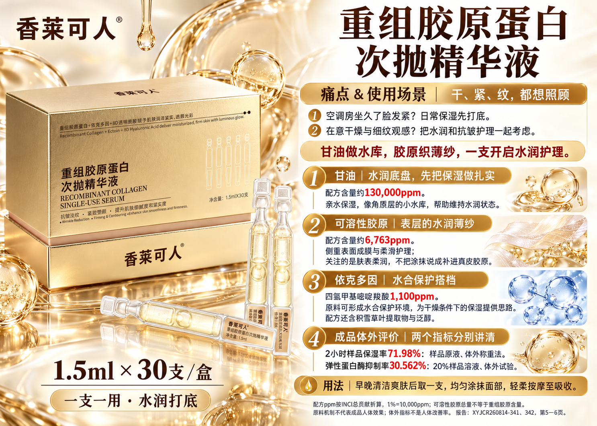
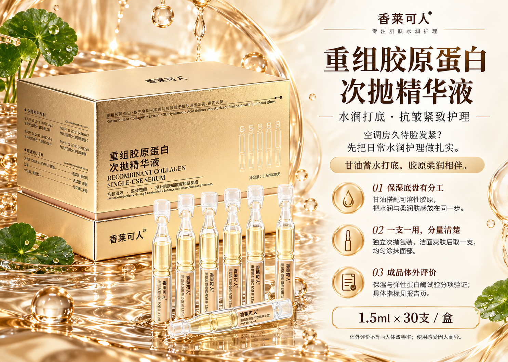
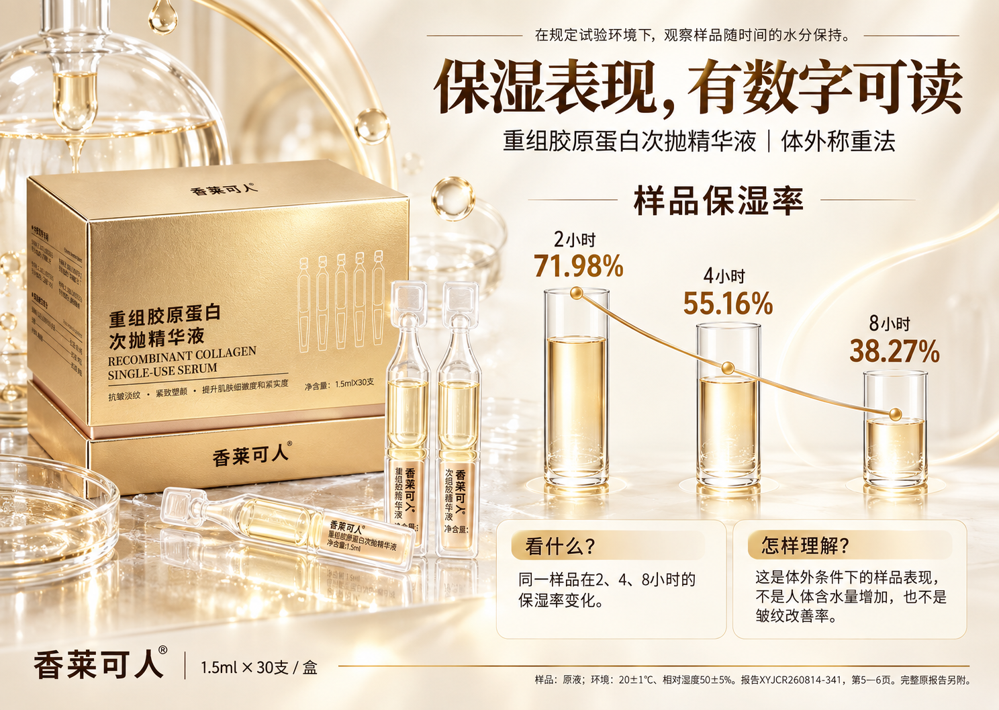
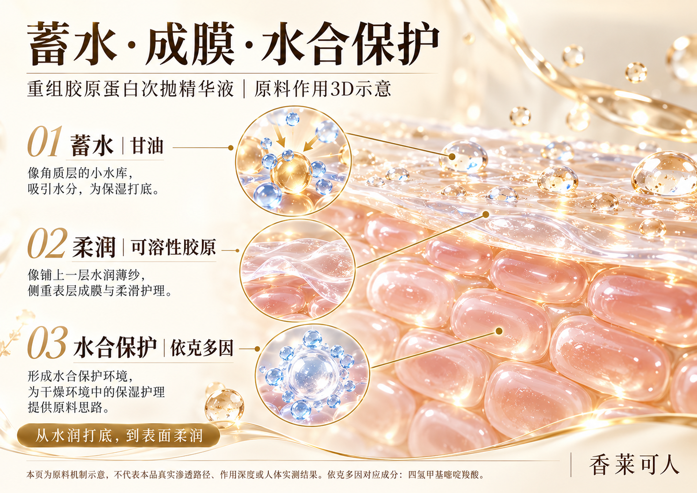
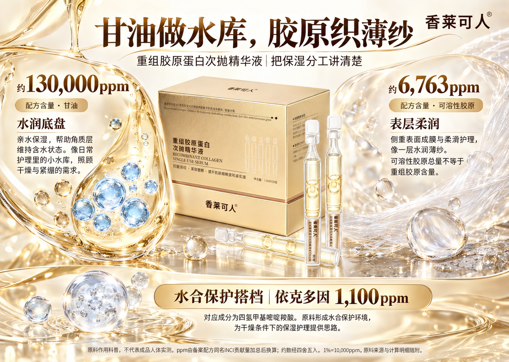
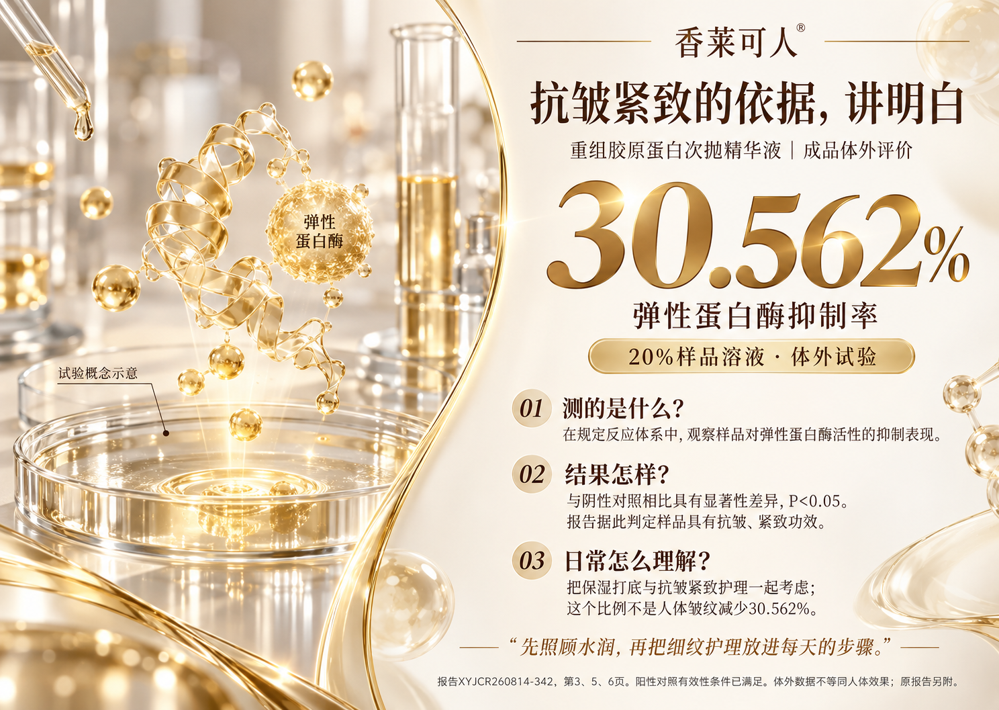
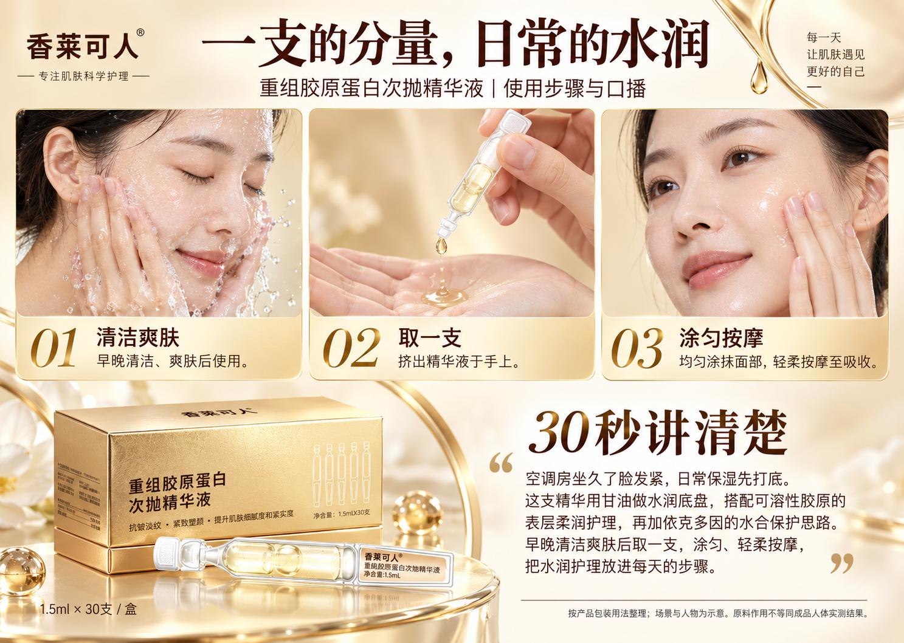
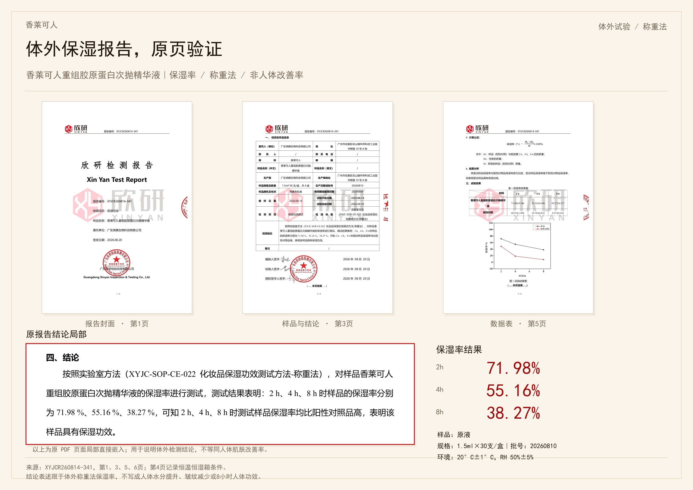
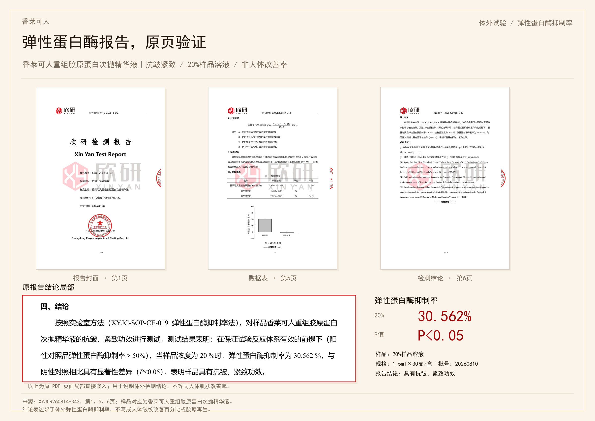

# 香莱可人·重组胶原蛋白次抛精华液

甘油与可溶性胶原的水润护理，次抛使用场景，配方原料与对应检测展示。

[返回全部案例](../README.md) · [图片许可](../LICENSE.md)

本套包含 9 张原始成品PNG，按用户指定版本公开。

### 00_单页直播手卡

### 01_产品主视觉

### 02_体外保湿评价

### 03_功效3D_蓄水与柔润

### 04_明星原料_水库与薄纱

### 05_功效讲解_抗皱紧致依据

### 06_用法与达人口播

### 07_原报告_保湿

### 08_原报告_抗皱紧致

