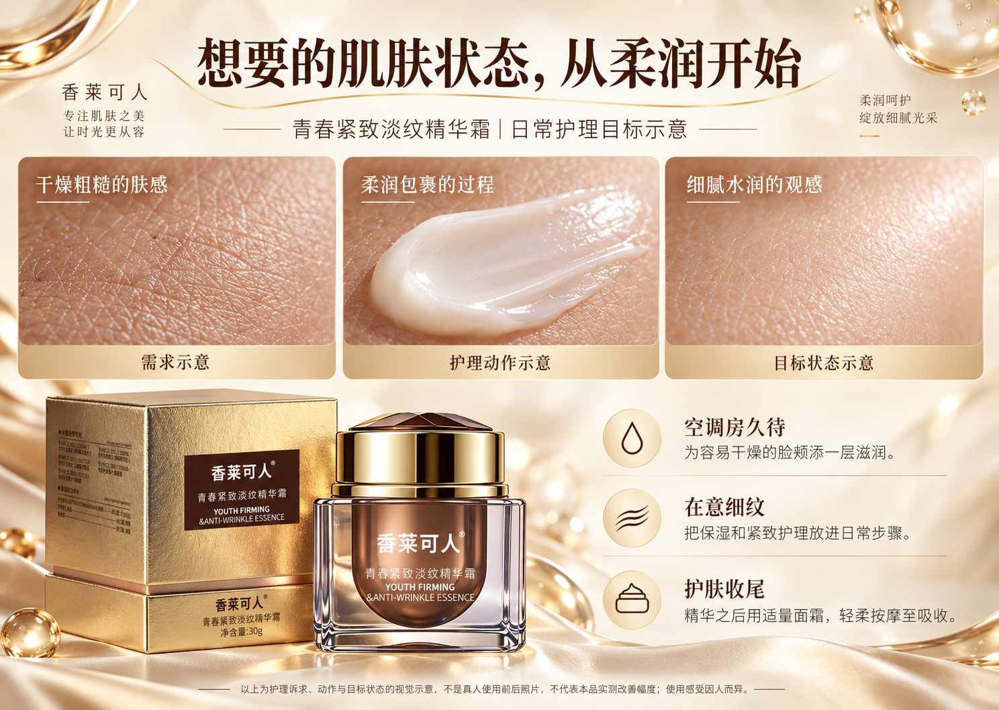
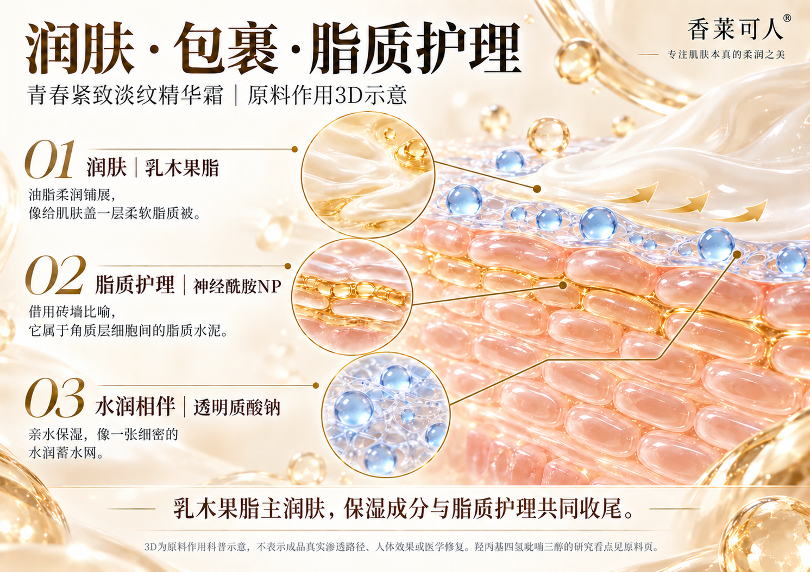
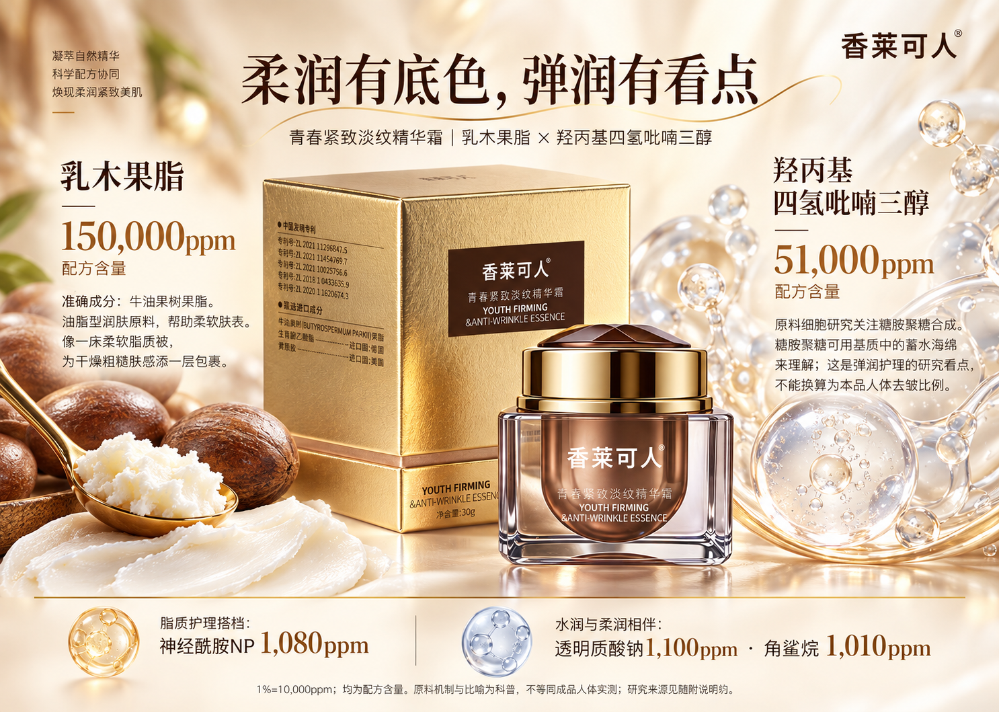
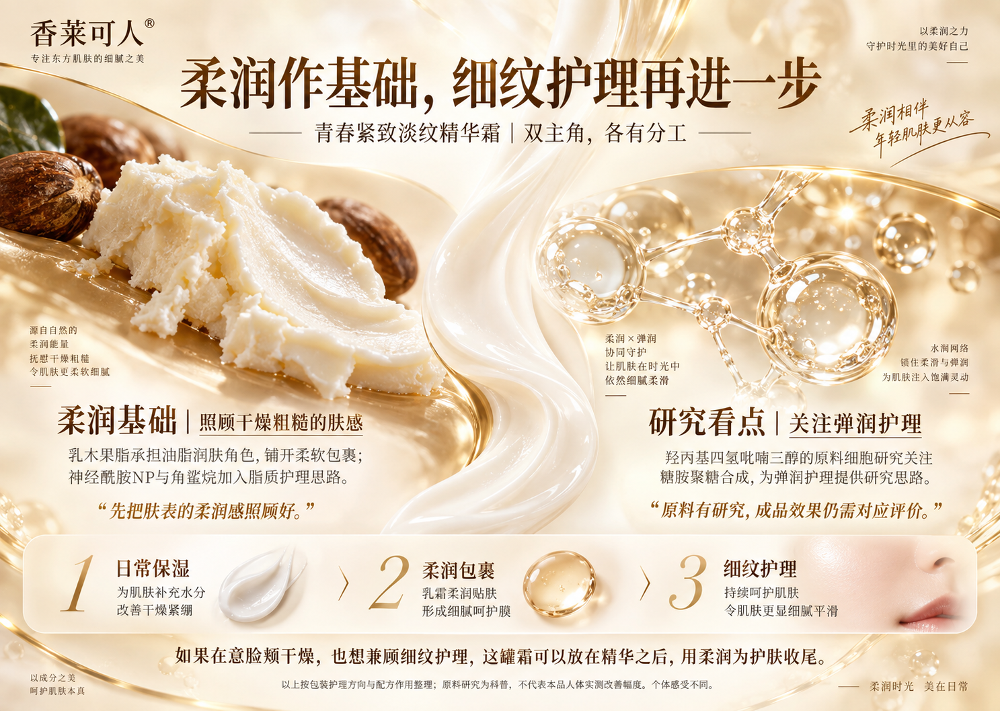
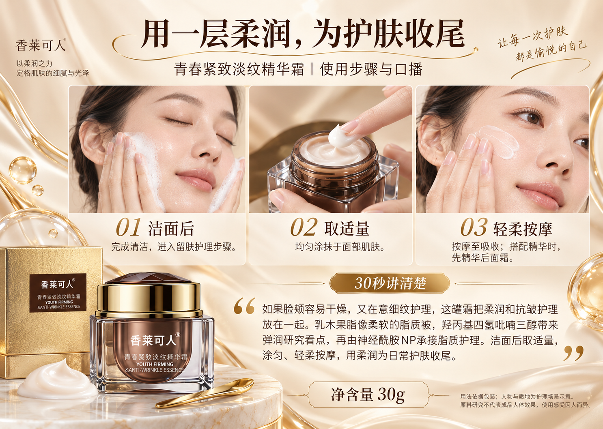

# 香莱可人·青春紧致淡纹精华霜

乳木果脂、羟丙基四氢吡喃三醇与神经酰胺NP的原料分工，柔润肤感与日常护理收尾。

[返回全部案例](../README.md) · [图片许可](../LICENSE.md)

本套包含 7 张原始成品PNG，按用户指定版本公开。

### 00_单页直播手卡

### 01_产品主视觉

### 02_肌肤状态与护理目标

### 03_功效3D_柔润包裹

### 04_明星原料_柔润与弹润

### 05_功效讲解_双主角分工

### 06_用法与达人口播

